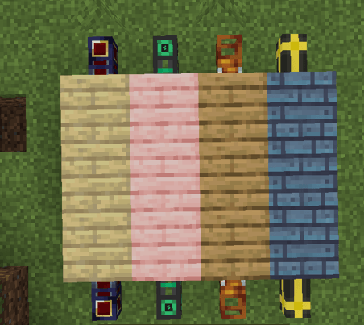
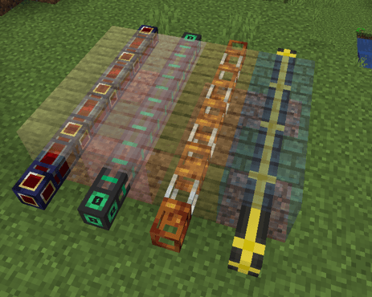

<p align="center"></p>

# Cable Facades
[](https://www.curseforge.com/minecraft/mc-mods/cable-facades)
[](https://www.curseforge.com/minecraft/mc-mods/cable-facades/files)

**This mod allows you to cover up pretty much any cable/pipe from any mod!
You can manually add entries in the config file at cable_facades-common.toml**

```toml
#List of blocks that are allowed to be covered. Supports '*' as a wildcard.
blocks = ["pipez:*_pipe", "mekanism:*_cable", "etc.."]
```

Without holding a wrench:



When holding a wrench:



## Supported Versions

| NeoForge |        |
|----------|--------|
|          | 1.20.1 |
| Forge    |        |
|          | 1.20.1 |

1.21 coming soon!

## Pre-Supported Mods
* Computer Craft
* Create
* Cyclic
* Elemental Craft
* Embers
* GregTechCEu Modern
* LaserIO
* Mekanism
* Mekanism Extras
* Pipez
* Pneumatic Craft Repressurized
* Powah
* Pretty Pipes
* Pretty Pipes Fluids
* Thermal Series

## Dependencies
None! Cable Facades is a standalone mod

## Mod Authors
Tags are also available for blocks, just add the tag: `#cable_facades:supports_facade`

## Discord
[](https://discord.gg/m4EHeRjfZ9)

Share your configs in our [Discord](https://discord.gg/m4EHeRjfZ9) so that we can expand support !

## Contributors
<a href="https://github.com/Porting-Dead-Mods/Cable-Facades/graphs/contributors">
  
</a>
